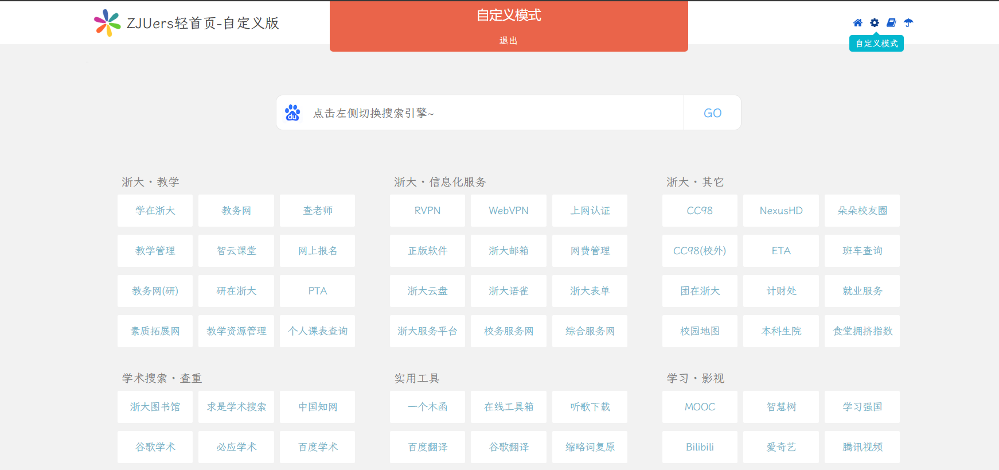
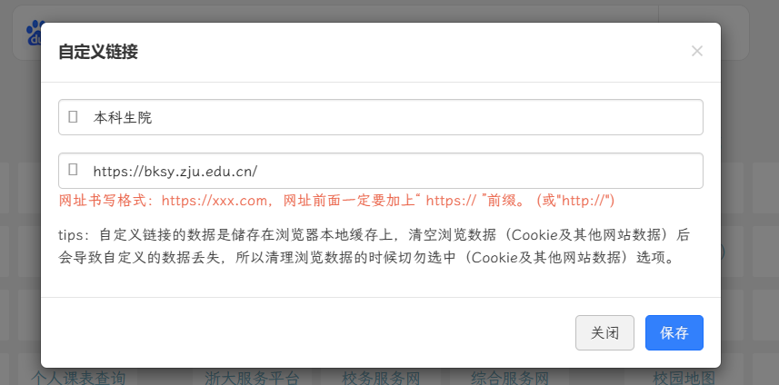
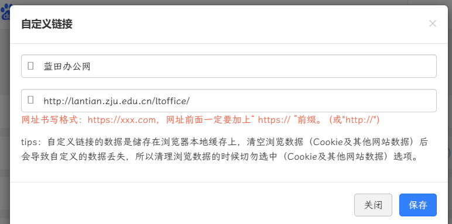
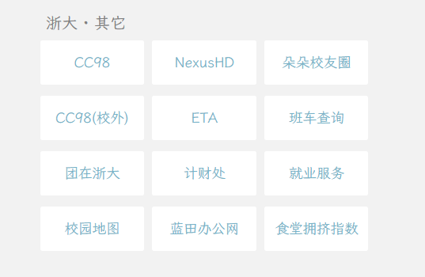
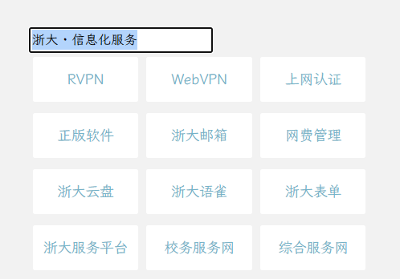
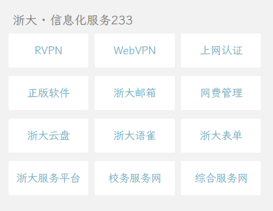
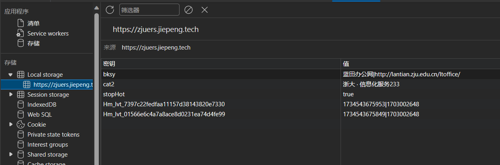

# ZJUers 轻首页 · 大模型自定义版

一个可自定义的简洁多领域网址导航，专为浙大师生打造。

## 一分钟部署到 GitHub Pages/制作自己的专属导航页

> 不需要服务器，零成本，免费托管。

### 1. Fork 这个仓库

打开 [https://github.com/wychuang/Zjuers-navigation-DIY](https://github.com/wychuang/Zjuers-navigation-DIY)，点右上角的 **Fork** 按钮，把仓库复制到你自己的 GitHub 账号下。

### 2. 开启 GitHub Pages

在你 fork 后的仓库页面，进入 **Settings → Pages**：

- **Source** 选 **Deploy from a branch**
- **Branch** 选 `master`，目录选 `/ (root)`
- 点 **Save**

等一两分钟，GitHub 会自动给你生成一个网址：
`https://<你的用户名>.github.io/Zjuers-navigation-DIY`

### 3. 绑定自定义域名（可选）

如果你有自己的域名：

1. 在 **Settings → Pages** 的 **Custom domain** 输入你的域名，点 Save
2. 去你的域名 DNS 管理处，添加一条 `CNAME` 记录，指向 `<你的用户名>.github.io`
3. 仓库根目录的 `CNAME` 文件里写的就是你的域名，直接修改它即可

### 4. 修改导航链接（编辑 HTML）

直接在 GitHub 网页上编辑 `index.html`：

- 找到对应分类（搜索 `cat1`、`cat-ai-chat` 等 ID）
- 修改 `<a>` 标签的 `href` 和链接文字
- 提交后 GitHub Pages 会自动重新部署，等一两分钟生效

---

## 功能特色

- 🔍 **统一搜索框** — 可切换 18 个搜索引擎（百度、Google、Bing、知乎、B站、GitHub 等）
- 📚 **10 个导航分类** — 教学、AI 对话、AI 工具、信息化服务、学术搜索等
- 🎨 **自定义编辑模式** — 页面右上角齿轮 → 自由编辑链接名和链接
- 🌙 **暗黑模式** — 点击底部"深色模式"按钮切换，自动记住你的偏好
- 📱 **响应式布局** — 手机/平板/桌面自适应

---

## 如何自定义记录？

点击右边齿轮可进入自定义设置。



演示中，我们选择右边"浙大·其他"下边的本科生院，会出现如下窗口：



我们将其修改为蓝田办公网：



点击保存，即可看到修改后的效果：



此时，我们点击蓝田办公网，即可跳转到蓝田办公网。而且，浏览器会自动记住你的设置，下次打开该轻首页时，你的设置依然有效。（如果你清除了浏览器缓存，那么你的设置也会被清除）

同时，自定义设置还支持修改小标题，如下图所示：





## 如何还原单个记录？

以 Edge 浏览器为例，我们按下 F12 键，打开开发者工具，选择应用程序：

如果没看到应用程序，那么我们先点击 `+` 号，再选择应用程序：


我们点击其中的 `Local Storage` ，可以看到我们之前修改的记录：



我们可以右键删除某个记录，再刷新页面，即可还原该记录。

## 进入较慢怎么办？

初次打开网页，进入可能会比较慢，这是因为浏览器需要加载一些资源（而且网站是部署在 Github Pages 上的，国内访问速度可能会比较慢）。如果你觉得进入速度太慢，可以尝试使用其他浏览器，或者使用代理。

---

## 本地开发

用 VS Code + Live Server 在本地预览修改：

```bash
# 克隆仓库
git clone https://github.com/<你的用户名>/Zjuers-navigation-DIY.git

# 用 VS Code 打开
code Zjuers-navigation-DIY

# 右键 index.html → Open with Live Server（默认端口 5502）
```

项目是纯静态 HTML/CSS/JS，改完直接提交，GitHub Pages 自动部署。
